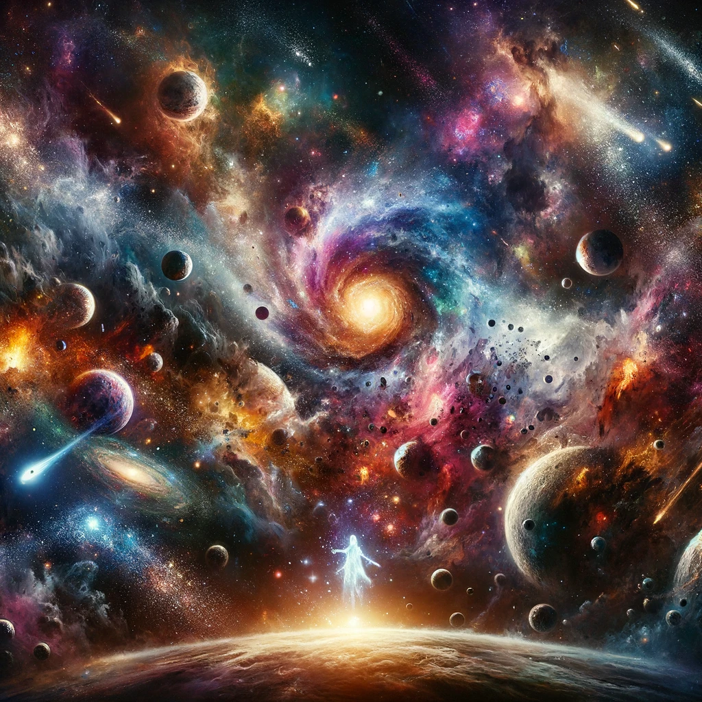

# Celestial Chaos

In the vast expanse where silence roars,
Amongst the stars, celestial chaos soars.
A cosmic dance of galaxies untamed,
Infinite realms, by mortals unnamed.

Orbiting paths in disarray,
Comets streak with tails astray.
Planets collide in a fiery embrace,
Stardust scatters through the endless space.

Black holes whisper, the devouring call,
Swallowing light, the universe's thrall.
Nebulas bloom in chaotic grace,
Painting the void with a vibrant face.

The suns implode with brilliant might,
Casting the cosmos into eternal night.
Yet from the ashes of stars that fall,
New worlds arise, defying it all.

Celestial chaos, a beauty so wild,
Crafting existence, nature's undefiled.
In the cosmic dance of entropy's play,
Life finds a way, in the dark's dismay.

So gaze upon the night sky, so vast,
Where celestial chaos holds the universe fast.
In its disorder, a harmony so profound,
In the endless chaos, creation is found.
